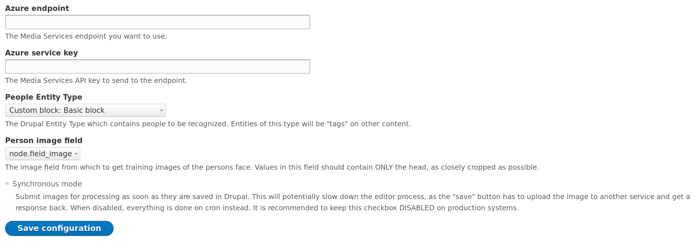

Image Auto Tag
===

A Drupal module that submits uploaded images to a face detection and recognition service. It will automatically tag an entity with the people who appear in its image field. 

**This is an experimental module. No support is offered or expected. I may completely rewrite this at a whim. Do not use it in production!**

This was my code project for Drupalcon Nashville 2018. For now, it only supports Azure Computer Vision. I plan to refactor this into a plugin, and provide at least one alternative backend service. For now, since Azure is free for the first 5000 requests per month, this is a great option for many Drupal sites to take advantage of facial recognition.

How to use it
===

Install
---

1. Get a free API key for Azure Computer Vision's *Face API* at https://azure.microsoft.com/en-us/try/cognitive-services/ . Note your endpoint URI and API key somewhere safe.
2. Set up a fresh Drupal 8 install, on PHP 7.x . Download and install this module.

Configure
---

1. Configure the module at `admin/config/media/image_auto_tag`:

  * `Azure endpoint` is the URL (ending in a `/`) of your API endpoint you received in step 1. Probably `https://someregion.api.cognitive.microsoft.com/face/v1.0`.
  * `Azure service key` is the API key you received in step 1.
  * `People entity type` is the Drupal entity which is used to "tag" other content. This is likely a taxonomy vocabulary, but it can be anything supported by entity_reference.
  * `Person image field` is the field on the `People entity type` where you will upload images of their face. These images are used to train the service to recognize those people.
  * Click `Save configuration`, and it will check your credentials and entered information for you.
2. Set up the fields which will contain photos to be scanned, and the resulting tags. Edit an image field, to find the new checkbox for `Detect faces in uploaded images`. Enable it, and use the drop-down to select the entity_reference field which will receive the tags based on this image.

Use it
---

1. Add some People entities. For each one, add as many images of their face as you can find. The more, the better! Face images should be cropped to just their head area, and should have a visible face. This doesn't have to be precise, but a full-body shot won't work.
2. When you're done adding People, the system has to start Training. Visit `admin/config/media/image_auto_tag/operations`, and click the `Train now` button. Training can take a few seconds to a few minutes, depending on how many faces you've submitted. You can see the current training status at the top of the operations page.
3. When training is complete, you can add images to that field you configured. When you save the node, you'll find it automatically adds references for all the people visible.
4. Welcome your new machine learning overlords.

Notes
---

* Higher face image quality means better recognition precision. Please consider high-quality faces: frontal, clear, and face size is 200x200 pixels (100 pixels between eyes) or bigger.
* Each person entry can hold up to 248 faces.
* JPEG, PNG, GIF (the first frame), and BMP format are supported. The allowed image file size is from 1KB to 4MB.
* Out of detectable face size (36x36 - 4096x4096 pixels), large head-pose, or large occlusions will cause failures.
* Up to 10 faces can be returned for an image. Faces are ranked by face rectangle size from large to small.
* Face detector prefer frontal and near-frontal faces. There are cases that faces may not be detected, e.g. exceptionally large face angles (head-pose) or being occluded, or wrong image orientation.

Next Steps
---

* ~~Asynchronous mode - training and detection should happen on cron.~~
* Batch API for submission and training "now", a la search API.
* Refactor into a plugin-based system, get OpenFace or similar working as a second plugin.
* More tests. You can always use more tests!
* Allow more than one entity type to define "people".
* Allow more than 10 faces to be tracked per image.
* (maybe) support other attributes commonly detected by these systems.